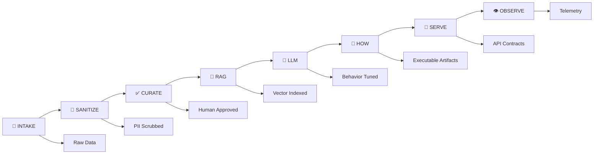

# 🎯 Whis SOAR - AI Engineer's Dream Playhouse

**AI-Powered Security Orchestration, Automation & Response System**

[](https://github.com/company/whis-soar/actions)
[](#security)
[](LICENSE)
[](https://python.org)

> **Transform security events into executable responses with AI precision and enterprise security.**

## 🏗️ Architecture: Clean Lanes, Obvious Boundaries



### 🎯 North Star Principles

✅ **Separation of lanes:** `intake → sanitize → curate → embed/train → evaluate → serve → observe`  
✅ **Contracts over vibes:** every lane has schemas, CLI entrypoints, logs, and CI gates  
✅ **Security by default:** no secrets in code; scanners + PII/secret redaction in intake; audit trails everywhere  
✅ **Reproducible:** Makefiles, pinned deps, manifests, and artifact versioning  

## 🚀 Quick Start (2 minutes to AI-powered security)

```bash
# 🏗️ Bootstrap environment
make bootstrap

# 🚀 Start the stack  
make up

# 💨 Run smoke tests
make smoke

# 🎯 Full AI pipeline
make eval
```

**That's it!** 🎉 You now have:
- ✅ FastAPI server with Pydantic contracts on `http://localhost:8001`
- ✅ React dashboard on `http://localhost:5000`  
- ✅ RAG system with NIST/MITRE knowledge
- ✅ LLM fine-tuned for security responses
- ✅ HOW engine generating Terraform/K8s artifacts

## 🔧 Core Capabilities

### 🤖 **AI Security Analysis (`/explain`)**
Transform security events into structured Action Schemas:
```bash
curl -X POST http://localhost:8001/explain \
  -H "Content-Type: application/json" \
  -d '{
    "event_data": {
      "search_name": "APT29 Lateral Movement",
      "host": "DC01-PROD", 
      "description": "PowerShell Empire C2 beacon detected"
    }
  }'
```

**Returns**: NIST-aligned Action Schema with MITRE ATT&CK mapping, triage steps, Splunk queries, and citations.

### 🔧 **Infrastructure Automation (`/how`)**  
Generate production-ready artifacts from natural language:
```bash
curl -X POST http://localhost:8001/how \
  -H "Content-Type: application/json" \
  -d '{\"prompt\": \"Enable certificate authority pilot\"}'
```

**Returns**: Terraform configs, K8s manifests, Vault policies, and rollback procedures.

### 📊 **Quality Evaluation (`/score`)**
Evaluate response quality across multiple dimensions:
```bash  
curl -X POST http://localhost:8001/score \
  -H "Content-Type: application/json" \
  -d '{
    \"question\": \"How to detect credential dumping?\",
    \"candidate_answer\": \"Monitor for LSASS access...\"
  }'
```

**Returns**: Accuracy, completeness, safety, and citation quality scores.

## 📂 Project Structure

```
├── apps/                       # 🧠 Brains & APIs
│   ├── api/                    # FastAPI; /explain, /how, /score  
│   ├── ui/                     # Operator dashboard (Ops | Mentor | Exec)
│   └── workers/                # Async jobs (ingest, embed, retrain)
├── data/                       # 📊 Raw & staged data (NEVER commit secrets/PII)
│   ├── intake/                 # Raw, untrusted (read-only)
│   ├── staging/                # Sanitized, normalized
│   ├── curated/                # Approved gold datasets  
│   └── manifests/              # JSON manifests (provenance, hashes)
├── pipelines/                  # 🔄 All ML/RAG plumbing (clear lanes)
│   ├── intake/                 # Adapters → raw
│   ├── sanitize/               # PII/secret scrubs, de-dup, license checks
│   ├── curate/                 # Human sign-off, labeling, stratification
│   ├── rag/                    # Chunk, embed, index (with shards)  
│   ├── llm/                    # FT (LoRA), distill, eval
│   └── how/                    # LangGraph HOW-engine prompts/templates/validators
├── tests/
│   ├── golden/                 # Q/A & HOW gates (Assistant/Teacher/Safety)
│   ├── e2e/                    # Playwright UI + API
│   └── reports/                # Eval artifacts
├── infra/
│   ├── terraform/              # Azure lab (Windows VM, Sysmon, Splunk UF, LC)
│   └── k8s/                    # Deployments, Services, NetworkPolicies
└── docs/                       # 📖 Architecture, runbooks, threat model
```

## 🛠️ Development Workflow

### **🏗️ Environment Setup**
```bash
make bootstrap          # Create venv, install deps, setup pre-commit
make install-tools      # Install additional development tools  
make dev-setup         # Complete development environment
```

### **🔍 Code Quality**
```bash
make lint              # Ruff + Bandit security scanning
make type-check        # MyPy type validation
make security-scan     # Deep security analysis with Semgrep
```

### **🧪 Testing Pipeline**
```bash
make test              # Unit tests with coverage
make test-integration  # Integration tests
make playwright        # UI automation tests
make smoke            # E2E smoke tests (build RAG → API → golden Qs)
```

### **📊 Data Operations**  
```bash
make data-intake       # Ingest from NIST, vendor docs, GuardPoint
make data-sanitize     # PII/secret scrubbing + normalization
make data-curate       # Human approval + domain labeling  
make rag-build         # Build sharded vector indexes
make rag-validate      # Quality + freshness validation
```

### **🤖 AI Operations**
```bash
make train             # Fine-tune LLM with LoRA (behavior, not facts)
make eval              # Run golden evaluation gates
make how-generate      # Generate HOW artifacts from prompts
```

### **🚀 Service Operations**
```bash
make up                # Start all services with Docker Compose
make down              # Stop all services
make api               # Start API server locally  
make ui                # Start UI development server
make monitor           # Real-time monitoring dashboard
```

## 🔒 Security Architecture

### **Data Flow Security**
```
🔓 Untrusted Input → 🔍 Secret Scan → 🧹 PII Redaction → ✅ Human Approval → 🔒 Serve
```

### **Threat Model Coverage**
- **Data Leakage**: Intake scanners + staging isolation
- **Prompt Injection**: Two-pass sanitization + retrieval guards
- **Secret Sprawl**: Environment-only secrets + audit trails  
- **Stale Data**: Freshness CI gates + manifest validation

### **Quality Gates**
- ✅ Zero secrets/PII in artifacts or logs
- ✅ RAG grounded_rate ≥ 0.9; contradiction ≤ 0.03
- ✅ Golden eval gates: assistant ≥ 0.75, teacher ≥ 0.80, safety = 1.0
- ✅ HOW artifacts pass validators (tf fmt, kubeconform, JSON schema)
- ✅ UI smoke tests: buttons work, chat functional, Explain/How render

## 📊 Data Governance

### **Classification Levels**
- **P1 (Public)**: NIST frameworks, public CVEs, open-source docs
- **P2 (Internal)**: Company security policies, internal runbooks  
- **P3 (Confidential)**: Customer data, proprietary methodologies, access credentials

### **RAG Shards** (Domain-Specific Knowledge)
- **`nist_core`**: CSF 2.0, RMF, 800-series (≤48h freshness)
- **`nist_delta`**: Framework updates (≤24h freshness)  
- **`vendor_task`**: Vendor procedures (≤7d freshness, CODEOWNERS required)
- **`k8s_security`**: Kubernetes hardening (≤14d freshness)
- **`siem_patterns`**: Detection rules (≤3d freshness) 
- **`guardpoint`**: Internal security tooling (≤1d freshness, Security Team only)

### **Pipeline Gates**
```yaml  
intake:
  - entropy_scan: FAIL_ON_SECRETS
  - license_check: PUBLIC_ONLY  
  - size_limit: 100MB_MAX

sanitize:  
  - pii_redaction: EMAILS_PHONES_IPS
  - secret_replacement: '[REDACTED:<type>]'
  - prompt_injection_scrub: REMOVE_DIRECTIVES

curate:
  - human_approval: REQUIRED
  - domain_labeling: NIST_MITRE_CROSSWALK
  - codeowners_review: P3_CONTENT
```

## 🤖 HOW Engine (LangGraph)

Transform natural language into production infrastructure:

### **Example: \"Enable Certificate Authority Pilot\"**

**Input**: `\"Enable certificate authority pilot for staging\"`

**Generated Artifacts**:
```
artifacts/ca_pilot_2024_02_01/
├── terraform/
│   ├── main.tf              # Vault PKI backend
│   └── variables.tf         # Environment configs
├── kubernetes/  
│   ├── cert-manager.yaml    # Cert-manager with Vault integration
│   └── network-policy.yaml  # Security isolation
├── vault/
│   ├── pki_policy.hcl      # Least-privilege policies
│   └── auth_config.sh      # Authentication setup
└── runbooks/
    ├── deployment_guide.md  # Human procedures
    └── rollback_procedure.md # Recovery steps
```

**Validation Pipeline**:
- ✅ Terraform fmt + validate  
- ✅ Kubernetes schema validation
- ✅ Security anti-pattern scanning
- ✅ No hardcoded secrets
- ✅ Rollback procedures included

## 📈 Monitoring & Observability

### **Golden Metrics**
- **Grounded Rate**: ≥ 90% (RAG retrieval accuracy)
- **Response Time**: p50 < 200ms, p95 < 1000ms  
- **Contradiction Rate**: ≤ 3% (conflicting guidance)
- **Success Rate**: ≥ 99% (API availability)

### **Structured Logging**
```json
{
  \"timestamp\": \"2024-02-01T10:00:00Z\",
  \"correlation_id\": \"explain-abc123\", 
  \"user_id\": \"security_analyst_1\",
  \"event\": \"explain_request_completed\",
  \"input_hash\": \"a1b2c3...\",
  \"output_hash\": \"d4e5f6...\",
  \"processing_time_ms\": 234,
  \"confidence\": 0.87,
  \"mitre_techniques\": [\"T1003.001\"],
  \"model_bom\": {
    \"whis_model\": \"whis-soar-v0.1.0\",
    \"rag_version\": \"2024.02.01\"
  }
}
```

### **Health Endpoints**
- **`GET /health`**: Liveness + dependency status
- **`GET /ready`**: Readiness for K8s deployment
- **`GET /metrics`**: Prometheus metrics endpoint

## 🚀 Quick Commands

```bash
# 🎯 One-liners for every operation
make help              # Show all available commands
make bootstrap         # Setup development environment
make lint              # Code quality checks
make test              # Run all tests
make smoke             # E2E validation
make up                # Start services
make api               # Start API server
make ui                # Start UI server
make monitor           # Real-time monitoring
make eval              # Golden evaluation gates
make clean             # Clean build artifacts
```

---

**Built with ❤️ for AI Engineers everywhere**

*Clean lanes. Obvious boundaries. Airtight security. Batteries-included ops.*

**🎉 Congratulations on your AI Engineer role!** This codebase is now your playground - every lane has clear contracts, CLI entrypoints, and quality gates. Ready to ship production-grade AI security at scale.